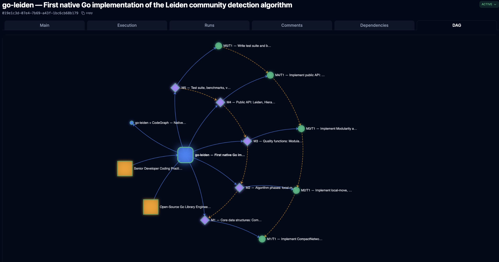

# go-leiden

[](https://pkg.go.dev/github.com/k8nstantin/go-leiden)
[](https://opensource.org/licenses/MIT)
[](https://golang.org/)
[](https://github.com/k8nstantin/OpenPraxis)

> **Status:** Released **v0.1.0** — the first synthetic Go library

**A native Go implementation of the Leiden community detection algorithm.** Zero external dependencies. Pure Go. Production quality.

---

## Milestone — the first synthetic Go library

go-leiden is, to our knowledge, **the first complete open-source Go library ported end-to-end by autonomous AI agents from a product DAG** — algorithm specification in, published Go module out, with **zero human code commits**.

The agentic OS reading the [graspologic-native](https://github.com/graspologic-org/graspologic-native) Rust source (Microsoft Research, MIT) was [OpenPraxis](https://github.com/k8nstantin/OpenPraxis). The product was modelled as a five-manifest DAG (M1→M2→M3→M4→M5). Each manifest fired sequentially. Each task ran with a cascading prompt (product → manifest → task → skills). When tasks failed, the [Trace-Grounded Feedback Loop](#the-trace-grounded-feedback-loop) self-improved the prompts and retried.

**Build stats — v0.1.0:**

| Metric | Value |
|---|---|
| Agent turns (M1–M5) | **609** |
| Wall-clock time | **2h 49m** |
| Lines of Go produced | **4,417** |
| Human code commits | **0** |
| Manifests | 5 (`M1` → `M5`) + 1 review-fix iteration (`M6`) |
| Source library ported | [graspologic-native](https://github.com/graspologic-org/graspologic-native) (Rust, Microsoft Research) |
| Target | `github.com/k8nstantin/go-leiden` v0.1.0, MIT, **zero deps** |

This is not a hand-written library with AI assistance, and it is not an AI-generated snippet. It is a complete, tested, published Go module — manifest DAG, cascading prompts, refinement-from-singletons per Traag (2019), karate-club validation, fuzz tests — built autonomously and verified by an independent server-side audit the agents could not see.

→ [How the build worked, manifest by manifest](#how-this-library-is-built--autonomous-ai-agents) · [The product DAG image](#the-product-dag)

---

## What problem does this solve?

Graph community detection is a fundamental operation in knowledge graphs, network analysis, code dependency mapping, recommendation systems, and document clustering. The two dominant algorithms are **Louvain** (2008) and **Leiden** (2019).

**The Go ecosystem has Louvain** (via `gonum/graph/community`).

**The Go ecosystem has no Leiden.**

This library fills that gap.

---

## Why Leiden over Louvain?

The Louvain algorithm has a well-documented flaw: it can produce **internally disconnected communities** — nodes grouped together that aren't actually reachable from each other within the community. This produces misleading results in any downstream system that assumes communities are coherent clusters.

The Leiden algorithm (Traag, Waltman & van Eck, 2019) introduces a **refinement phase** that explicitly prevents this. Leiden guarantees that every community it produces is well-connected. Communities represent genuine local structure, not artifacts of the greedy merge order.

In practice, for code knowledge graphs and document corpora, the difference is the separation between "these files belong together" and "these files happen to share a common import."

---

## Why this implementation?

We port from **[graspologic-native](https://github.com/graspologic-org/graspologic-native)** (Microsoft Research + Johns Hopkins University, MIT license) — the Rust implementation used in production by **[Microsoft GraphRAG](https://github.com/microsoft/graphrag)**.

We chose graspologic-native over the original [leidenalg](https://github.com/vtraag/leidenalg) (C++ + igraph) because:

| | leidenalg | graspologic-native | **go-leiden** |
|---|---|---|---|
| Language | C++ | Rust | **Go** |
| igraph dependency | ✓ (500k+ lines C) | ✗ | ✗ |
| External deps | Yes | No | **Zero** |
| Static binary | No | Yes | **Yes** |
| Production use | Research | Microsoft GraphRAG | **Research** |
| Resolution formula | Reference impl | Corrected¹ | **Corrected¹** |

> ¹ graspologic-native identified and corrected a resolution scaling bug in the original CWTSLeiden Java reference implementation. go-leiden uses the corrected formula.

---

## Prior art in Go

go-leiden is **not** the first Go module published under the name "leiden." Two earlier repositories show up on `pkg.go.dev`:

- **[`github.com/vsuryav/leiden-go`](https://github.com/vsuryav/leiden-go)** (Nov 2025, MIT) — a Go community-detection package that targets the Leiden algorithm. ~17 KB across three files, adjacency-map graph representation (`map[string]map[string]float64`), modularity-only quality function.
- **[`github.com/bloodmagesoftware/leiden`](https://github.com/bloodmagesoftware/leiden)** (Jun 2024, AGPL-3.0) — unrelated to the algorithm.

We acknowledge `leiden-go` as the earlier publication. The two implementations differ substantively in scope and fidelity to the Traag, Waltman & van Eck (2019) paper. Honest comparison:

| | leiden-go | **go-leiden** |
|---|---|---|
| Graph representation | adjacency map (`map[string]map[string]float64`) | **CSR `CompactNetwork`** (int-indexed, cache-friendly) |
| Quality functions | Modularity | **Modularity + CPM** |
| Refinement phase | BFS connectivity check on the full community, then local moves on existing nodes | **Refinement-from-singletons** per Traag (2019) eqs (14)(15), with well-connectedness γ-test |
| Aggregation phase | Not implemented (source comment: *"in practice, we track this across iterations"*) | **Full aggregation** — communities collapse to super-nodes; recursive |
| Hierarchical Leiden | — | **`HierarchicalLeiden`** with `MaxClusterSize` (the GraphRAG use case) |
| Randomness | global `rand.Seed` (deprecated as of Go 1.20) | per-call `*rand.Rand` instance |
| Cancellation | — | `context.Context` throughout |
| Validation | unit tests | unit + benchmarks + fuzz, karate-club modularity in [0.35, 0.45] |
| Dependencies | zero | **zero** |

The differences matter where they matter. For small graphs and exploratory work, `leiden-go` will produce reasonable partitions. For knowledge graphs, GraphRAG-style chunking, or any downstream system that depends on Leiden's well-connectedness *guarantee* (the entire reason the algorithm exists), you need the refinement-from-singletons construction and the aggregation phase. That is what go-leiden ports from `graspologic-native`.

If your needs are met by `leiden-go`, use it.

---

## Installation

```bash
go get github.com/k8nstantin/go-leiden
```

Requires Go 1.22+. Zero external dependencies.

---

## Quick start

```go
package main

import (
    "context"
    "fmt"
    leiden "github.com/k8nstantin/go-leiden"
)

func main() {
    // 6 nodes: two tight triangles connected by a weak bridge
    // Nodes are integers 0..5
    edges := []leiden.Edge{
        {From: 0, To: 1, Weight: 1.0},
        {From: 1, To: 2, Weight: 1.0},
        {From: 0, To: 2, Weight: 1.0},
        {From: 3, To: 4, Weight: 1.0},
        {From: 4, To: 5, Weight: 1.0},
        {From: 3, To: 5, Weight: 1.0},
        {From: 2, To: 3, Weight: 0.01}, // weak bridge
    }

    opts := leiden.DefaultOptions()
    opts.Seed = 42 // deterministic

    result, err := leiden.Leiden(context.Background(), 6, edges, opts)
    if err != nil {
        panic(err)
    }

    fmt.Printf("Quality: %.4f\n", result.Quality)
    fmt.Printf("Communities: %d\n", leiden.CommunityCount(result.Partition))

    for clusterID, nodes := range leiden.GroupBy(result.Partition) {
        fmt.Printf("  cluster %d: nodes %v\n", clusterID, nodes)
    }
    // cluster 0: nodes [0 1 2]
    // cluster 1: nodes [3 4 5]
}
```

---

## Options

```go
opts := leiden.Options{
    Resolution:  1.0,               // community granularity; higher = more, smaller communities
    Randomness:  0.001,             // refinement stochasticity; 0 = deterministic greedy
    Iterations:  2,                 // full passes over the network
    Trials:      1,                 // run N times, return best quality
    Seed:        42,                // 0 = random; >0 = fully deterministic
    Quality:     leiden.Modularity, // or leiden.CPM
}
```

---

## Hierarchical Leiden

For large graphs where communities need to stay under a size limit (e.g. knowledge graph chunks for LLM context windows — the use case in Microsoft GraphRAG):

```go
result, err := leiden.HierarchicalLeiden(edges, leiden.HierarchicalOptions{
    Options:        leiden.DefaultOptions(),
    MaxClusterSize: 50,
})

for _, hc := range result {
    if hc.IsFinal {
        fmt.Printf("node=%-20s cluster=%d level=%d\n", hc.Node, hc.Cluster, hc.Level)
    }
}
```

---

## How this library is built — autonomous AI agents

This is not a human-authored codebase. go-leiden is built entirely by **autonomous AI agents** orchestrated by [OpenPraxis](https://github.com/k8nstantin/OpenPraxis) — a peer-to-peer workflow engine for autonomous coding agents.

### The product DAG



Every component is modelled as an entity in the OpenPraxis graph. The build is a directed acyclic graph of manifests (components) and tasks (implementation units):

```
Product: go-leiden
├─ Skill: Senior Developer Coding Practices
├─ Skill: Open-Source Go Library Engineering
│
├─ M1 — Core data structures
│    CompactNetwork (CSR adjacency list), Clustering, Edge types, errors
│    └─ T1: Implement CompactNetwork, Clustering, Edge, errors
│         ↓
├─ M2 — Algorithm phases
│    Local-move phase, refinement phase (Leiden innovation), aggregation loop
│    └─ T1: Implement three algorithm phases
│         ↓
├─ M3 — Quality functions
│    Modularity, CPM, resolution scaling (corrected formula)
│    └─ T1: Implement Modularity and CPM
│         ↓
├─ M4 — Public API
│    Leiden(), HierarchicalLeiden(), go.mod, README
│    └─ T1: Implement public API + module setup
│         ↓
└─ M5 — Test suite
     Karate club validation, 10k-node benchmarks, fuzz testing
     └─ T1: Write tests, benchmarks, fuzz
```

Each manifest maps to a GitHub issue. Each task carries a cascading prompt:

```
Product prompt  →  "what are we building, why, module path, reference"
  ↓
Manifest prompt →  "this component's role, dependencies, deliverables"
  ↓
Task prompt     →  "exact types, function signatures, formulas, reference files to read"
  ↓
Skill prompts   →  "Go library standards, testing conventions, zero-dep rules"
```

The agent that runs M2/T1 knows: the product it's contributing to, where M2 fits in the chain, the exact graspologic-native Rust files to read before writing a line, and the precise QVI formula to implement. It doesn't guess — it executes from a precise spec.

### The Trace-Grounded Feedback Loop

go-leiden is built on top of a feedback system we built into OpenPraxis itself: the **[Trace-Grounded Feedback Loop](https://github.com/k8nstantin/OpenPraxis)**.

Three capabilities activate automatically for every task run:

**1. Prior context injection**
Every agent run sees its own history. If T2 (algorithm phases) fails and retries, the agent sees the prior run's execution trace, the tool calls it made, and the error it hit. It cannot repeat the same mistake blind. This is especially critical for M2's weight cache correctness — the hardest part of the port.

**2. Pass-rate tracking**
`GET /api/execution/frontier` tracks pass rates per task and per manifest. If M3's quality function math is wrong, the pass rate drops and we see it before it propagates to M4's public API.

**3. Autonomous proposer loop**
When a task hits 2 consecutive non-transient failures (`max_turns` or `deliverable_missing`), the system automatically fires a **proposer task** that analyzes the failure pattern and generates an improved prompt. The improved prompt is tested against the pass rate and kept only if it improves by ≥5%. The prompts self-improve without human intervention.

```
T2 fails (weight cache wrong)
  ↓
T2 fails again (same root cause, different expression)
  ↓
Proposer fires automatically
  ↓
Proposer analyzes: "agent misses the clusterWeights cache update on node removal"
  ↓
Proposer generates sharper prompt: adds explicit warning about cache invariants
  ↓
New prompt tested: pass rate improves → kept
  ↓
T2 retries with improved prompt → succeeds
```

This is recursive: we built a feedback loop to improve autonomous agents, and that same loop is now building this open-source library. go-leiden is a live demonstration of the system.

### Why this matters

This project answered a specific question: **can autonomous agents build a production-quality, ecosystem-ready Go library — from algorithm specification to published package — without human code commits?**

**v0.1.0 is the answer: yes.** 609 turns, 2h 49m wall-clock, 4,417 lines of Go, zero human commits, karate-club modularity in the expected range, fuzz tests pass.

---

## Build log — v0.1.0

Each step was a manifest — one branch, one PR, one review before the next fired. Click any step to read the full agent prompt.

| Step | What it built | Task | Issue | Status |
|---|---|---|---|---|
| [M1 — Core data structures](docs/manifests/m1.md) | `CompactNetwork` (CSR adjacency list), `Clustering`, `Edge` types, error sentinels. The foundation everything else builds on. | [T1 — Implement CompactNetwork, Clustering, Edge](docs/manifests/m1.md#task-t1--implement-compactnetwork-clustering-edge-types-errors) | [#1](https://github.com/k8nstantin/go-leiden/issues/1) | ✅ Completed |
| [M2 — Algorithm phases](docs/manifests/m2.md) | The three Leiden phases: local-move (greedy), refinement-from-singletons (the Leiden innovation over Louvain), aggregation (recursive contraction). | [T1 — Implement three phases](docs/manifests/m2.md#task-t1--implement-local-move-refinement-aggregation-phases) | [#2](https://github.com/k8nstantin/go-leiden/issues/2) | ✅ Completed |
| [M3 — Quality functions](docs/manifests/m3.md) | Modularity and CPM scoring + resolution scaling (graspologic-native corrected formula). | [T1 — Implement Modularity and CPM](docs/manifests/m3.md#task-t1--implement-modularity-and-cpm-quality-functions) | [#3](https://github.com/k8nstantin/go-leiden/issues/3) | ✅ Completed |
| [M4 — Public API](docs/manifests/m4.md) | `Leiden()`, `HierarchicalLeiden()` (used by Microsoft GraphRAG), `Modularity()`. Sets up `go.mod` and README. | [T1 — Implement public API](docs/manifests/m4.md#task-t1--implement-public-api--gomod) | [#4](https://github.com/k8nstantin/go-leiden/issues/4) | ✅ Completed |
| [M5 — Tests + benchmarks](docs/manifests/m5.md) | Karate club validation, 10k-node benchmarks, fuzz testing. The publication gate. | [T1 — Write test suite](docs/manifests/m5.md#task-t1--write-test-suite-benchmarks-fuzz-tests) | [#5](https://github.com/k8nstantin/go-leiden/issues/5) | ✅ Completed |
| M6 — PR review fixes | Address all findings from senior-architect code review of PR #6: refinement formula correctness, doc.go completeness, comment accuracy, library hygiene. | T1 — Implement review fixes | (in PR #6 / #7) | ✅ Completed |

**Totals:** 609 turns · 2h 49m wall-clock · 4,417 lines of Go · 0 human code commits · `v0.1.0` released as `github.com/k8nstantin/go-leiden`.

→ [How autonomous agents build this — prompts, DAG, feedback loop](docs/index.md)

---

## Credits

This library would not exist without:

- **[Traag, Waltman & van Eck (2019)](https://arxiv.org/abs/1810.08473)** — *From Louvain to Leiden: guaranteeing well-connected communities.* Scientific Reports 9, 5233. The algorithm.

- **[leidenalg](https://github.com/vtraag/leidenalg)** by Vincent Traag — the original C++ + Python implementation. The authoritative reference for algorithm correctness. MIT license.

- **[graspologic-native](https://github.com/graspologic-org/graspologic-native)** by Microsoft Research and Johns Hopkins University — the Rust implementation we port from. Self-contained (no igraph), production-proven in Microsoft GraphRAG. MIT license.

- **[CWTSLeiden/networkanalysis](https://github.com/CWTSLeiden/networkanalysis)** — the Java reference implementation by the original authors.

- **[Graphify](https://graphify.net)** — the open-source Python code knowledge graph tool (47k GitHub stars) that inspired this library's application to code analysis.

- **[OpenPraxis](https://github.com/k8nstantin/OpenPraxis)** — the autonomous agent workflow engine that is building this library. The Trace-Grounded Feedback Loop, the product DAG, the cascading prompts — all OpenPraxis.

---

## License

MIT License. See [LICENSE](LICENSE).

Built with [OpenPraxis](https://github.com/k8nstantin/OpenPraxis) — autonomous agents, self-improving prompts, zero human code commits.
